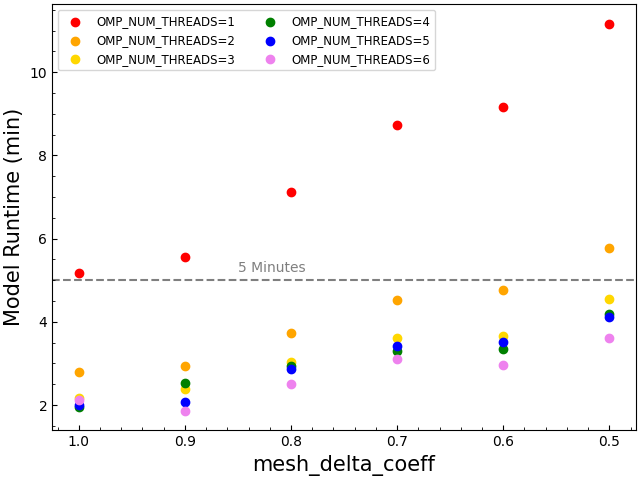

# Lab 2 - Changing Tempo

## Learning Goals

In this lab, we will be exploring how chemical different chemical composition gradients ($\nabla_{\mu}$, where $\mu$ is the mean-molecular weight) impact the *g*-mode period spacing. Our goals for this lab are:

- Run `MESA` starting from a precomputed `.mod` file
- Modify `run_star_extras.f90` to output profiles at set points in time 

## Background Science
As a review, the oscillation period ($\Pi_{n, \ell}$) for a *g*-mode of radial order $n$ and spherical degree $\ell$ is given by
$$
\Pi_{n, \ell} = \frac{\Pi_0}{\sqrt{\ell(\ell + 1)}}(n+\epsilon),
$$
where $\epsilon$ is a small constant and $\Pi_0$ is given by:
$$
\Pi_0 = 2\pi^2\left(\int \frac{N}{r}\,dr\right)^{-1},
$$
where $N$ is the Brunt-Väisälä frequency and the integral is taken over the propagation cavity of the *g*-mode. The period spacing, $\Delta \Pi_{\ell}$, is then the period difference between two modes of consecutive order and the same spherical degree:
$$
\Delta\Pi_{\ell} = \Pi_{n+1, \ell} - \Pi_{n, \ell}.
$$ 
In the asymptotic limit (large $n$) for a chemically homogenous medium (i.e., $\nabla_{\mu}=0$), this spacing is approximately constant. That is what we observed when we plotted $\Delta \Pi_{1}$ vs. $\Pi_{n, 1}$ for our zero-age main-sequence (ZAMS) model in Lab 1. At the ZAMS--the start of hydrogen ignition--`MESA` begins with a chemically homogenous mixture.

However, as soon as the star evolves beyond the ZAMS, hydrogen fusion disrupts the chemical homogeneity and introduces a chemical gradient. The gradient causes sharp spikes in the Brunt-Väisälä frequency, which--in an ideal gas--is described by:
$$
N^2 \approx \frac{g^2\rho}{p}\left(\nabla_{\mathrm{ad}}-\nabla+\nabla_{\mu}\right),
$$
where
$$
\nabla = \frac{d\ln T}{d\ln p}, \quad
\nabla_{\mathrm{ad}} = \left(\frac{\partial \ln T}{\partial \ln p}\right)_{\mathrm{ad}}, \quad
\mathrm{and} \quad
\nabla_{\mu} = \frac{d\ln \mu}{d\ln p}.
$$

If $\nabla_{\mu} \neq 0$, then spikes in the Brunt-Väisälä frequency will *trap* *g*-modes; this mode trapping leads to periodic *dips* in a plot of $\Delta \Pi_{1}$ vs. $\Pi_{n, 1}$. We are going to induce a chemical gradient in our model by evolving through the main-sequence to investigate these dips.

## Task 1: A Fresh Start
**Start by copying a clean working directory from `$MESA_DIR/star/work` and placing it where you want it to be.** It is helpful to rename it something descriptive at this point as well--something like `day2_lab2`.

> [!WARNING]
> It is generally not a great idea to work directly inside the clean `$MESA_DIR/star/work` work directory; instead, you should copy it and place it somewhere else before making any changes.


We will copy the clean directory from `$MESA_DIR/star/work` and place it somewhere else using the Linux command `cp`. If you are already where you want the work directory to be, you can use the shortcut `./` to say "place this here". Otherwise, replace `./` with the path to your intended location. If you were to use the shortcut, it would look like this:
```bash
cp -r $MESA_DIR/star/work ./day2_lab2
```
The `-r` is a flag that tells the system to copy the work directory *recursively*. In other words, it copies all of the contents inside the directory, not just the directory itself. If you have any problems, make sure that your `MESA` environment variables are set. This will not work if `$MESA_DIR` is undefined.


## Task 2: Getting the (`&star_`) Job Done
For now, we are only going to edit `inlist_project`; open it up and take a second to see what the basic work inlist looks like.

We are going to build our inlist one namelist at a time. Starting at the top, we are going to alter the `&star_job` namelist first. For this section, the [star_job reference page](https://docs.mesastar.org/en/26.4.1/reference/star_job.html) will be a helpful resource.

Rather than create a pre-main sequence model every time we run our inlist, we are going to start from a pre-computed zero-age main sequence model named `zams.mod`, which you can download here (TODO: figure out how to download). This model is for a $5 \, \mathrm{M_{\odot}}$ star with solar metallicty at the zero-age main sequence.

We also won't need to save a model at the end of our run. Therefore, we **can remove the three lines that refer to creating a pre-main sequence model or saving a model at termination**.

In their place, we need to load our `zams.mod` file and tell `MESA` to start our new run there. **Look at the `star_job` reference page and see if you can sort out how to load a saved model**. If you get stuck you can expand the hint below.


To load a saved model, we need to tell `MESA` to load a model, *and* tell it the name of the model we want to load. We do with these to lines:
```fortran
load_saved_model = .true.
load_model_filename = 'zams.mod'
```
At this point, your `&star_job` namelist should look something like this:
```fortran
&star_job

   ! see star/defaults/star_job.defaults

   ! start run with zams.mod
   load_saved_model = .true.
   load_model_filename = 'zams.mod'

   ! display on-screen plots
   pgstar_flag = .true.

/ ! end of star_job namelist
```


We don't need to make any changes to the `&eos` and `&kap` namelists. They are sufficient for what we are trying to do here.

> [!NOTE]
> For science cases, you may want to consider changing parameters in these namelists. It isn't guaranteed that the defaults will always be right for your particular case.

## Task 3: Taking `&control[s]`
Now we can move on to the `&controls` namelist. For this section, the [controls reference page](https://docs.mesastar.org/en/26.4.1/reference/controls.html) will be helpful.

The basic `inlist_project` file helpfully breaks the `&controls` namelist into smaller chunks that can tell you about what the namelist can do. 

Starting in the "starting specifications" section, we need to **change the `initial_mass` to 5** since our initial model will expect a 5 solar-mass star. We can leave the metallicity as it is.

We can tell our model when to terminate in the "when to stop" section. The current stopping condition is set to terminate at the zero-age main sequence. Since we are *starting* at the ZAMS, we can go ahead and **delete everything from `! when to stop` to `! wind`**. 

In it's place, we will add our own stopping condition. Since we are interested in what is happening during the main-sequence, we just need to pick a stopping condition that gets us through the main sequence. To make sure this happens, we are going to end our model at the terminal-age main sequence. This will also give us an opportunity to see what the period spacing looks like there. 

**Explore the "when to stop" section of the controls reference page and find a stopping condition that terminates at the TAMS**. If you get stuck, feel free to expand the following hint.


It is likely that in your exploration you came across this stopping condition:
```fortran
stop_at_phase_TAMS = .true.
```
This condition will definitely terminate when we want it to, but the preset `stop_at_phase_X` conditions have definitions based on the physics happening at that phase; it is a good idea to familiarize yourself with the actual definitions before using a phase-based stopping condition. 

If you look for the subroutine `set_phase_of_evolution` in `$MESA_DIR/star/private/star_utils.f90` and search for the definition of `phase_TAMS`, you will see that it is defined by the core hydrogen abundance:
```fortran
         else if (center_h1 <= 1d-6) then
            s% phase_of_evolution = phase_TAMS
```
In other words, `phase_TAMS` is triggered when central hydrogen dips below 1 part in a million. That means that `stop_at_phase_TAMS = .true.` is probably okay to use as a stopping condition in our case; however, an entirely equivalent stopping condition could have been:
```fortran
xa_central_lower_limit_species(1) = 'h1'
xa_central_lower_limit(1) = 1d-6
```
At this point, your `&controls` namelist should look something like:
```fortran
&controls

   ! see star/defaults/controls.defaults

   ! starting specifications
   initial_mass = 5 ! in Msun units
   initial_z = 0.02

   ! when to stop
   ! stop at the terminal age main sequence (TAMS)
   ! defined by center_h1 <= 1d-6 (core hydrogen depletion)
   ! see line 2957 of $MESA_DIR/star/private/star_utils.f90  
   stop_at_phase_TAMS = .true.

   ! wind

   ! atmosphere

   ! rotation

   ! element diffusion

   ! mlt

   ! mixing

   ! timesteps

   ! mesh

   ! solver
   ! options for energy conservation (see MESA V, Section 3)
   energy_eqn_option = 'dedt'
   use_gold_tolerances = .true.

   ! output

/ ! end of controls namelist
```


## Task 4: Insert funny mesh pun here
The next section we will need to change is the "mesh" section. This section is for controls related to the spatial resolution of our model. `MESA` operates by separating a stellar model into concentric rings with some thickness we will call $\Delta r$. To make sure that important physics are captured, `MESA` also has an adaptive mesh refinement (AMR) algorithm that will decrease $\Delta r$ in regions as needed or increase $\Delta r$ in regions where high resolution isn't necessary. However, it is entirely possible that the AMR algorithm doesn't fully capture the physics you are interested in--sometimes you may want a higher spatial resolution. In our case, `GYRE` is sensitive to spatial resolution, so we will want to increase the default resolution.

To increase the resolution of our model, we are going to use the variable `mesh_delta_coeff`, which is a multiplicative factor on $\Delta r$. In other words, it is $a$ in the expression $a\Delta r$. By default, `MESA` sets `mesh_delta_coeff = 1`. If we want to *increase* the resolution, we need to set `mesh_delta_coeff` to a value *less than 1* to break our model into smaller chunks.

Increasing the resolution of a model can be a bit more computationally expensive depending on your machine. Lower values for `mesh_delta_coeff` will take longer to ran than others. It is then up to you to make an informed decision based on the specifications of your specific machine. The primary factor that will effect the time it takes your model to run is the `OMP_NUM_THREADS` parameter you have set in your environment variables. Based on the value you set there, **use the following plot to choose a value for `mesh_delta_coeff` that will ensure your model will run in less than 5 minutes**. Essentially, if you have `OMP_NUM_THREADS > 2`, any value will work; feel free to pick any value (less than 1!) and be ready to compare with your tablemates at the end of the lab.



## Task 5: Insert funny output pun here
Finally, we will need to edit the "output" section of the namelist to make sure that our model makes the data we need to give to GYRE. `MESA` does not create a pulsation profile by default, so we need to turn on the correct flag to make sure it does. **Explore the "controls for output" section of the controls reference page and find the flag to write pulsation profiles for GYRE**. Check the following hint if you get stuck or want to check your answer


The flag we are interested in is `write_pulse_data_with_profile`, which will save the data we need for `GYRE` later; set it to `.true.`.

We also need to specify the format of the pulsation data. We are going to use `.FGONG` files, which are compatible with `GYRE`. Altogether, your output section should look something like:
```fortran
   ! output

   ! setting profile format for GYRE
   write_pulse_data_with_profile = .true.
   pulse_data_format = 'FGONG'
```


With the correct flag, `MESA` will write a unique `.FGONG.data` file for every profile it creates. We want to make sure that `MESA` only writes these profiles when we want them and doesn't write any profiles otherwise. This will require some extra code in our `./src/run_star_extras.f90`, which we will get to later. In the meantime, we are going to **turn profile generation off by including the following line in our inlist**:
```fortran
profile_interval = -1
```
Since `MESA` can't write a profile "every minus one" steps, it will interpet this `-1` as `off`.

## Task 5.5: Ignoring Our History
This final step is not strictly necessary but can be helpful if you are rerunning multiple times and want to keep a clean working directory. Since we are interested in only specific points in time for this lab and not the evolution of the star over it's whole lifetime, we don't really need a `history.data` file. Similarly, since we aren't going to be restarting our runs in the middle, we won't need photos either. We can **turn history file and photo generation off with the following lines**:
```fortran
photo_interval = -1
do_history_file = .false.
```
>[!IMPORTANT]
> You should only do this if you are *certain* that you don't need such data. Otherwise, you may be keeping yourself from the data you need.

## Task 6: Test flight
At this point, our inlist should be almost complete. To make sure everything is correct, we can **run our inlist**:
```bash
./clean; ./mk; ./rn
```
>[!NOTE]
> Placing a semicolon between subsequent commands lets you run each command in one line rather than typing/running each command individually.

If data starts printing to the terminal, your inlist is correct and you are ready to move to the next step. Go ahead and **terminate the run (`ctrl+c`)**.

If you have gotten an error, work with your TA to find the cause or expand the following hint for a complete inlist.


At this point, your full inlist should look something like this (make sure you have an empty line at the end; without it, `MESA` will not run!):
```fortran

&star_job

   ! see star/defaults/star_job.defaults

   ! start run with zams.mod
   load_saved_model = .true.
   load_model_filename = 'zams.mod'

   ! display on-screen plots
   pgstar_flag = .true.

/ ! end of star_job namelist


&eos

   ! eos options
   ! see eos/defaults/eos.defaults

/ ! end of eos namelist


&kap
   ! kap options
   ! see kap/defaults/kap.defaults
   use_Type2_opacities = .true.
   Zbase = 0.02

/ ! end of kap namelist


&controls

   ! see star/defaults/controls.defaults

   ! starting specifications
   initial_mass = 5 ! in Msun units
   initial_z = 0.02

   ! when to stop
   ! stop at the terminal age main sequence (TAMS)
   ! defined by center_h1 <= 1d-6 (core hydrogen depletion)
   ! see line 2957 of $MESA_DIR/star/private/star_utils.f90  
   stop_at_phase_TAMS = .true.

   ! wind

   ! atmosphere

   ! rotation

   ! element diffusion

   ! mlt

   ! mixing

   ! timesteps

   ! mesh
   ! increase mesh "resolution"
   mesh_delta_coeff = 0.8

   ! solver
   ! options for energy conservation (see MESA V, Section 3)
   energy_eqn_option = 'dedt'
   use_gold_tolerances = .true.

   ! output

   ! setting profile format for GYRE
   write_pulse_data_with_profile = .true.
   pulse_data_format = 'FGONG'

   ! don't save profiles unless told otherwise
   ! NECESSARY; otherwise we can't guarantee
   ! profiles will save at the expected times
   profile_interval = -1
   
   ! don't save photos or a history file to save space
   ! not strictly necessary
   photo_interval = -1
   do_history_file = .false.

/ ! end of controls namelist

```

## Task 7: Something something `run_star_extras.f90`
Now we need to make sure we can actually get the data we need. Having `MESA` output a profile at every time step and then finding the specific timesteps that we need is certainly an option here, but that can get tedious very quickly. Instead, we are going to keep profile generation turned "off" and only turn it on when we know we are going to get the data we need.

As a reminder, our goal is to see how chemical composition gradients effect the *g*-mode period spacing. To get a composition gradient, we are going to evolve through the main-sequence and request profiles at different parts of the main-sequence. The best way to quantify this is by the central hydrogen abundance; as hydrogen abundance goes down, it is reasonable to assume that the chemical composition has changed due to fusion products. We are then going to request profiles from `MESA` at different core hydrogen abundances.

To do this, we are going to have to delve into `run_star_extras.f90`. **In your working directory, open up `./src/run_star_extras.f90` and take a look at it**. You should see something like this:
```fortran
! ***********************************************************************
!
!   Copyright (C) 2010-2025  Bill Paxton & The MESA Team
!
!   This program is free software: you can redistribute it and/or modify
!   it under the terms of the GNU Lesser General Public License
!   as published by the Free Software Foundation,
!   either version 3 of the License, or (at your option) any later version.
!
!   This program is distributed in the hope that it will be useful,
!   but WITHOUT ANY WARRANTY; without even the implied warranty of
!   MERCHANTABILITY or FITNESS FOR A PARTICULAR PURPOSE.
!   See the GNU Lesser General Public License for more details.
!
!   You should have received a copy of the GNU Lesser General Public License
!   along with this program. If not, see <https://www.gnu.org/licenses/>.
!
! ***********************************************************************

module run_star_extras

   use star_lib
   use star_def
   use const_def
   use math_lib

   implicit none

   ! these routines are called by the standard run_star check_model
contains

   include 'standard_run_star_extras.inc'

end module run_star_extras

```
This is the basic `run_star_extras.f90` format. We first need to find `standard_run_star_extras.inc` and copy all of its contents to our file. To find it, **run the following command in your terminal**:
```bash
find $MESA_DIR/*/standard_run_star_extras.inc
```
It should output something like:
```bash
path_to_mesa_directory/include/standard_run_star_extras.inc
```
**Replace the line `include standard_run_star_extras.inc` in your `run_star_extras.f90` file with the contents of `standard_run_star_extras.inc`**. Expand the following hint if you want to confirm that your file looks as it should.

If you got stuck on the previous step, copy these contents into your `./src/runs_star_extras.f90` file:
```fortran
! ***********************************************************************
!
!   Copyright (C) 2010-2025  Bill Paxton & The MESA Team
!
!   This program is free software: you can redistribute it and/or modify
!   it under the terms of the GNU Lesser General Public License
!   as published by the Free Software Foundation,
!   either version 3 of the License, or (at your option) any later version.
!
!   This program is distributed in the hope that it will be useful,
!   but WITHOUT ANY WARRANTY; without even the implied warranty of
!   MERCHANTABILITY or FITNESS FOR A PARTICULAR PURPOSE.
!   See the GNU Lesser General Public License for more details.
!
!   You should have received a copy of the GNU Lesser General Public License
!   along with this program. If not, see <https://www.gnu.org/licenses/>.
!
! ***********************************************************************

module run_star_extras

   use star_lib
   use star_def
   use const_def
   use math_lib

   implicit none

   ! these routines are called by the standard run_star check_model
contains

         subroutine extras_controls(id, ierr)
         integer, intent(in) :: id
         integer, intent(out) :: ierr
         type (star_info), pointer :: s
         ierr = 0
         call star_ptr(id, s, ierr)
         if (ierr /= 0) return

         ! this is the place to set any procedure pointers you want to change
         ! e.g., other_wind, other_mixing, other_energy  (see star_data.inc)


         ! the extras functions in this file will not be called
         ! unless you set their function pointers as done below.
         ! otherwise we use a null_ version which does nothing (except warn).

         s% extras_startup => extras_startup
         s% extras_start_step => extras_start_step
         s% extras_check_model => extras_check_model
         s% extras_finish_step => extras_finish_step
         s% extras_after_evolve => extras_after_evolve
         s% how_many_extra_history_columns => how_many_extra_history_columns
         s% data_for_extra_history_columns => data_for_extra_history_columns
         s% how_many_extra_profile_columns => how_many_extra_profile_columns
         s% data_for_extra_profile_columns => data_for_extra_profile_columns

         s% how_many_extra_history_header_items => how_many_extra_history_header_items
         s% data_for_extra_history_header_items => data_for_extra_history_header_items
         s% how_many_extra_profile_header_items => how_many_extra_profile_header_items
         s% data_for_extra_profile_header_items => data_for_extra_profile_header_items

      end subroutine extras_controls


      subroutine extras_startup(id, restart, ierr)
         integer, intent(in) :: id
         logical, intent(in) :: restart
         integer, intent(out) :: ierr
         type (star_info), pointer :: s
         ierr = 0
         call star_ptr(id, s, ierr)
         if (ierr /= 0) return
      end subroutine extras_startup


      integer function extras_start_step(id)
         integer, intent(in) :: id
         integer :: ierr
         type (star_info), pointer :: s
         ierr = 0
         call star_ptr(id, s, ierr)
         if (ierr /= 0) return
         extras_start_step = 0
      end function extras_start_step


      ! returns either keep_going, retry, or terminate.
      integer function extras_check_model(id)
         integer, intent(in) :: id
         integer :: ierr
         type (star_info), pointer :: s
         ierr = 0
         call star_ptr(id, s, ierr)
         if (ierr /= 0) return
         extras_check_model = keep_going
         if (.false. .and. s% star_mass_h1 < 0.35d0) then
            ! stop when star hydrogen mass drops to specified level
            extras_check_model = terminate
            write(*, *) 'have reached desired hydrogen mass'
            return
         end if


         ! if you want to check multiple conditions, it can be useful
         ! to set a different termination code depending on which
         ! condition was triggered.  MESA provides 9 customizable
         ! termination codes, named t_xtra1 .. t_xtra9.  You can
         ! customize the messages that will be printed upon exit by
         ! setting the corresponding termination_code_str value.
         ! termination_code_str(t_xtra1) = 'my termination condition'

         ! by default, indicate where (in the code) MESA terminated
         if (extras_check_model == terminate) s% termination_code = t_extras_check_model
      end function extras_check_model


      integer function how_many_extra_history_columns(id)
         integer, intent(in) :: id
         integer :: ierr
         type (star_info), pointer :: s
         ierr = 0
         call star_ptr(id, s, ierr)
         if (ierr /= 0) return
         how_many_extra_history_columns = 0
      end function how_many_extra_history_columns


      subroutine data_for_extra_history_columns(id, n, names, vals, ierr)
         integer, intent(in) :: id, n
         character (len=maxlen_history_column_name) :: names(n)
         real(dp) :: vals(n)
         integer, intent(out) :: ierr
         type (star_info), pointer :: s
         ierr = 0
         call star_ptr(id, s, ierr)
         if (ierr /= 0) return

         ! note: do NOT add the extras names to history_columns.list
         ! the history_columns.list is only for the built-in history column options.
         ! it must not include the new column names you are adding here.


      end subroutine data_for_extra_history_columns


      integer function how_many_extra_profile_columns(id)
         integer, intent(in) :: id
         integer :: ierr
         type (star_info), pointer :: s
         ierr = 0
         call star_ptr(id, s, ierr)
         if (ierr /= 0) return
         how_many_extra_profile_columns = 0
      end function how_many_extra_profile_columns


      subroutine data_for_extra_profile_columns(id, n, nz, names, vals, ierr)
         integer, intent(in) :: id, n, nz
         character (len=maxlen_profile_column_name) :: names(n)
         real(dp) :: vals(nz,n)
         integer, intent(out) :: ierr
         type (star_info), pointer :: s
         integer :: k
         ierr = 0
         call star_ptr(id, s, ierr)
         if (ierr /= 0) return

         ! note: do NOT add the extra names to profile_columns.list
         ! the profile_columns.list is only for the built-in profile column options.
         ! it must not include the new column names you are adding here.

         ! here is an example for adding a profile column
         !if (n /= 1) stop 'data_for_extra_profile_columns'
         !names(1) = 'beta'
         !do k = 1, nz
         !   vals(k,1) = s% Pgas(k)/s% P(k)
         !end do

      end subroutine data_for_extra_profile_columns


      integer function how_many_extra_history_header_items(id)
         integer, intent(in) :: id
         integer :: ierr
         type (star_info), pointer :: s
         ierr = 0
         call star_ptr(id, s, ierr)
         if (ierr /= 0) return
         how_many_extra_history_header_items = 0
      end function how_many_extra_history_header_items


      subroutine data_for_extra_history_header_items(id, n, names, vals, ierr)
         integer, intent(in) :: id, n
         character (len=maxlen_history_column_name) :: names(n)
         real(dp) :: vals(n)
         type(star_info), pointer :: s
         integer, intent(out) :: ierr
         ierr = 0
         call star_ptr(id,s,ierr)
         if(ierr/=0) return

         ! here is an example for adding an extra history header item
         ! also set how_many_extra_history_header_items
         ! names(1) = 'mixing_length_alpha'
         ! vals(1) = s% mixing_length_alpha

      end subroutine data_for_extra_history_header_items


      integer function how_many_extra_profile_header_items(id)
         integer, intent(in) :: id
         integer :: ierr
         type (star_info), pointer :: s
         ierr = 0
         call star_ptr(id, s, ierr)
         if (ierr /= 0) return
         how_many_extra_profile_header_items = 0
      end function how_many_extra_profile_header_items


      subroutine data_for_extra_profile_header_items(id, n, names, vals, ierr)
         integer, intent(in) :: id, n
         character (len=maxlen_profile_column_name) :: names(n)
         real(dp) :: vals(n)
         type(star_info), pointer :: s
         integer, intent(out) :: ierr
         ierr = 0
         call star_ptr(id,s,ierr)
         if(ierr/=0) return

         ! here is an example for adding an extra profile header item
         ! also set how_many_extra_profile_header_items
         ! names(1) = 'mixing_length_alpha'
         ! vals(1) = s% mixing_length_alpha

      end subroutine data_for_extra_profile_header_items


      ! returns either keep_going or terminate.
      ! note: cannot request retry; extras_check_model can do that.
      integer function extras_finish_step(id)
         integer, intent(in) :: id
         integer :: ierr
         type (star_info), pointer :: s
         ierr = 0
         call star_ptr(id, s, ierr)
         if (ierr /= 0) return
         extras_finish_step = keep_going

         ! to save a profile,
            ! s% need_to_save_profiles_now = .true.
         ! to update the star log,
            ! s% need_to_update_history_now = .true.

         ! see extras_check_model for information about custom termination codes
         ! by default, indicate where (in the code) MESA terminated
         if (extras_finish_step == terminate) s% termination_code = t_extras_finish_step
      end function extras_finish_step


      subroutine extras_after_evolve(id, ierr)
         integer, intent(in) :: id
         integer, intent(out) :: ierr
         type (star_info), pointer :: s
         ierr = 0
         call star_ptr(id, s, ierr)
         if (ierr /= 0) return
      end subroutine extras_after_evolve

end module run_star_extras

```

Before we do anything else, it is a good idea to recompile and make sure that our file is correct. To do this, **run the following in your terminal**:
```bash
./clean; ./mk
```
If this runs without error, great! You are ready for the next step. If you get an error, take some time to debug with your TA/tablemates before moving forward. Remember that the previous hint has a correct version should you need it.

Your `run_star_extras.f90` file now has a series of subroutines that give us a hand in every step of `MESA`. To see a full flow of control diagram (and some extra information about using `run_star_extras.f90`), see ["Extending MESA"](https://docs.mesastar.org/en/latest/using_mesa/extending_mesa.html) on the docs.

The only subroutines we will be touching in this lab are `extras_startup`--which is run only once at the star of a `MESA` run--and `extras_finish_step`, which is run at the end of every successfully converged timestep. 

In `extras_finish_step`, we need to define a variable for the initial core hydrogen abundance, which we will store in `s% xtra(1)`, which is an internal variable that `run_star_extras.f90` will use. **Replace the entire `extras_startup` subroutine with the following code**:
```fortran
   subroutine extras_startup(id, restart, ierr)
      integer, intent(in) :: id
      logical, intent(in) :: restart
      integer, intent(out) :: ierr
      type (star_info), pointer :: s
      ierr = 0
      call star_ptr(id, s, ierr)

      s% xtra(1) = s% center_h1 

      if (ierr /= 0) return
   end subroutine extras_startup
```
where all we have done is add the line ``s% xtra(1) = s% center_h1``. This will internally store the initial hydrogen abundance, which we will need to use in our next step.

To actually tell `MESA` when to save a profile, we will need to make changes to `extras_finish_step`. At the end of every step, we will compare the current hydrogen abundance to the previous abundance. If both values are bracketing a user-specified hydrogen abundance, then we will ask `MESA` to save a profile. To specify what values we are interested in, we will use another internal array `s% x_ctrl(:)`, which we will specify in our inlist. More on that later. 

First, **just below the line `! s% need_to_update_history_now = .true.` in the `extras_finish_step` subroutine, add the following code:**
```fortran
      prev_h1 = s% xtra(1)
      
      if ( prev_h1 > s% x_ctrl(1) .and. s% center_h1 <= s% x_ctrl(1) ) then
         s% need_to_save_profiles_now = .true.
         s% need_to_update_history_now = .true.
         write(*, *) 'First checkpoint -- Central hydrogen abundance:' , s% center_h1
     else if ( prev_h1 > s% x_ctrl(2) .and. s% center_h1 <= s% x_ctrl(2) ) then
        s% need_to_save_profiles_now = .true.
        s% need_to_update_history_now = .true.
        write(*, *) 'Second checkpoint -- Central hydrogen abundance:' , s% center_h1
```
This code checks the previous hydrogen abundance (which we set initially in `extras_startup`) and compares it to our first/second specified `s% x_ctrl(:)` values and the actual hydrogen abundance. If we have reached either of the specified abundances, we tell `MESA` to save a profile by temporarily setting the flag `s% need_to_save_profiles_now` to `.true.`. However, if you were to try compiling this right now, you would get an error:
```terminal
../src/run_star_extras.f90:265:7:

  265 |       prev_h1 = s% xtra(1)
      |       1~~~~~~
Error: Symbol 'prev_h1' at (1) has no IMPLICIT type
make: *** [run_star_extras.o] Error 1

FAILED
```
This error is telling us that the variable `prev_h1` has not been given a type. In `FORTRAN`, we need to manually assign types to all variables. In this case, `prev_h1` is a real, floating point value. To make that clear to our compiler, **add the following line after `type (star_info), pointer :: s`**:
```fortran
real(dp) :: prev_h1
```
Now, everything should compile without any errors (`./clean; ./mk`).

## Task 8: I'm stumped for a fun name here
All that is left for us to do now is tell `MESA` what values to check with `x_ctrl(:)`. At the end of the `&controls` namelist in your inlist, include the following block of code:
```fortran
   ! extras
   x_ctrl(1) = 0.6d0
   x_ctrl(2) = 0.5d0
```
Now, we are ready to run our model! Go ahead and run with `./clean; ./mk; ./rn`. If all goes well, you should see some plots pop up. Go ahead let that run in the background while we move to the next step.

## Task 9: Catching the vibe
While we wait for our data, we can prepare our `GYRE` inlist so we can run it as soon as our data is ready. We will start with our inlist from Lab 1:
```fortran
&constants
/

&model
    model_type = 'EVOL'
    file = ''
    file_format = 'FGONG'
/

&mode
    l = 1
    m = 0
    n_pg_min = -150
    n_pg_max = -10
/

&osc
    outer_bound = 'VACUUM'
/

&scan
    grid_type = 'INVERSE'
    freq_min = 0.2
    freq_max = 2.5
    n_freq = 1000
    freq_units = 'CYC_PER_DAY'
    freq_min_units = 'CYC_PER_DAY'
    freq_max_units = 'CYC_PER_DAY'
/

&rot
/

&grid
/

&num
    diff_scheme = 'COLLOC_GL2'
/

&ad_output
    summary_file = ''
    summary_item_list = 'l,n_pg,m,freq,period'
    summary_file_format = 'HDF'
    freq_units = 'CYC_PER_DAY'
/

&nad_output
/

```
Our primary change will be in the `&scan` namelist. Beyond the ZAMS, the modes we are interested in will have different periods. We will need to change the frequency range and number of frequencies we search for. **Replace the lines `freq_min`, `freq_max`, and `n_freq` with these lines**:
```
    freq_min = 0.01
    freq_max = 10.0
    n_freq = 15000
```
We will also need to change the `file` line in the `&model` namelist. Once our run is complete, we will have 3 different profiles that we will need to run `GYRE` on individually. We will start with the first profile, which should have been saved at a core hydrogen abundance of 0.6. Since that is the first profile saved, it will be called `profile1.FGONG.data` in our `LOGS` directory. **Replace the `file` line with this code**:
```fortran
file = './LOGS/profile1.FGONG.data'
```
Since we will be running `GYRE` multiple times, we will also have to give our output files informative names. Replace the `summary_file` line in the `&ad_output` namelist with this code:
```fortran
summary_file = 'hydrogen0p6_summary.h5'
```
## Task 10: Running `GYRE`
Once your model is done running, you should be all set to **run `GYRE` on the first profile**:
```bash
$GYRE_DIR/bin/gyre gyre.in
```
If all goes well, you should have a file named `hydrogen0p6_summary.h5` in your working directory after `GYRE` completes. We will need to do this two more times, for the profile saved at a hydrogen abundance of 0.3 and the profile saved at the TAMS.

First, **change the file name in `gyre.in` to**:
```fortran
file = './LOGS/profile2.FGONG.data'
```
then **change the summary file name to**:
```fortran
summary_file = 'hydrogen0p3_summary.h5'
```
Go ahead and **run `GYRE` again with the new profile**. 

Finally, once that is done, **change the file name and summary names to**:
```fortran
file = './LOGS/profile3.FGONG.data'
```
```fortran
summary_file = 'TAMS_summary.h5'
```
**Run `GYRE` one more time**. Now, if you **run `ls *.h5`**, you should see the three summary files we made.

Thats it! Now it is time to analyze our data.

## Task 11: analysis
Download this (TODO: add download link) python file, which will plot the period spacing patterns and save a single `.png` file. Make sure it is in the same directory as your 3 `*.h5` files and **run it with**: 
```
python period_spacing.py
```
It will save a single file, named `period_spacing.png`. Open it up and see the fruits of your labor!

You should see the periodic dips in the period spacing that we would expect with the chemical gradients that we induced. You should also notice that the dips appear much more coherently for the intermeidate hydrogen abundance of 0.6 than in the 0.3 model, where the chemical gradient has become more involved (???) and is still more coherent than the TAMS dips, which are almost invisible and the period spacing becomes much more noisy.

Take some time to chat with your table about these results. In particular, if you all did different mesh values, compare your results and see what happned!