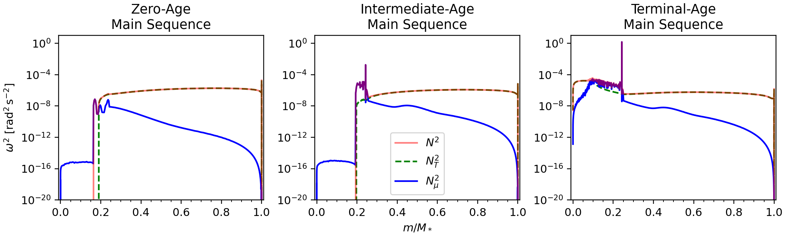

# Lab 2 - Changing Tempo

## Learning Goals

In this lab, we will be exploring how chemical composition gradients ($\nabla_{\mu}$, where $\mu$ is the mean-molecular weight) impact the *g*-mode period spacing. Our goals for this lab are:

- Run `MESA` starting from a precomputed `.mod` file
- Use `run_star_extras.f90` to control when profiles are saved
- Run `GYRE` at specific evolutionary stages using pulsation-profiles

## Background Science
As a review, the oscillation period ($\Pi_{n, \ell}$) for a *g*-mode of radial order $n$ and spherical degree $\ell$ is given by
$$
\Pi_{n, \ell} = \frac{\Pi_0}{\sqrt{\ell(\ell + 1)}}(n+\epsilon),
$$
where $\epsilon$ is a small constant and $\Pi_0$ is given by:
$$
\Pi_0 = 2\pi^2\left(\int \frac{N}{r}\,dr\right)^{-1},
$$
where $N$ is the Brunt-Väisälä frequency and the integral is taken over the propagation cavity of the *g*-mode. The period spacing, $\Delta \Pi_{\ell}$, is the difference in period between modes of consecutive order with the same spherical degree:
$$
\Delta\Pi_{\ell} = \Pi_{n+1, \ell} - \Pi_{n, \ell}.
$$ 
In the asymptotic limit (large $n$) for a chemically homogenous medium (i.e., $\nabla_{\mu}=0$), this spacing is approximately constant. That is what we observed when we plotted $\Delta \Pi_{1}$ vs. $\Pi_{n, 1}$ for our zero-age main-sequence (ZAMS) model in Lab 1. At the ZAMS--the start of hydrogen ignition--`MESA` begins with a chemically homogenous mixture.

As the star evolves beyond the ZAMS, nuclear burning alters the chemical composition of the core and introduces a composition gradient. The gradient causes peaks in the Brunt-Väisälä frequency, which--in an ideal gas--is described by:
$$
N^2 \approx \frac{g^2\rho}{p}\left(\nabla_{\mathrm{ad}}-\nabla+\nabla_{\mu}\right),
$$
where
$$
\nabla = \frac{d\ln T}{d\ln p}, \quad
\nabla_{\mathrm{ad}} = \left(\frac{\partial \ln T}{\partial \ln p}\right)_{\mathrm{ad}}, \quad
\mathrm{and} \quad
\nabla_{\mu} = \frac{d\ln \mu}{d\ln p}.
$$
The three plots below show the Brunt-Väisälä frequency as a function of stellar radius for three different evolutionary stages: zero-age main sequence, intermediate-age main sequence, and terminal-age main sequence. Notice in particular the blue curves, which show the contribution to the Brunt-Väisälä profiles due to the chemical composition gradient. 



At the ZAMS (left panel), the chemical composition gradient is near zero, creating a smooth Brunt-Väisälä profile. As a result, 
the asymptotic approximation works well and the period spacing remains nearly constant.

In the intermediate-age main sequence model (middle panel), $\nabla_{\mu} \neq 0$ due to hydrogen burning in the core. This produces a narrow spike in $N^2$. The spike partially reflects and traps some *g*-modes while others penetrate more deeply into the core. Because different modes now probe different regions, their periods are shifted by different amounts. This produces the characteristic "dips" or oscillatory deviations from a constant period spacing.

By the terminal-age main sequence (right panel), the composition gradient has broadened and become more complex as the star exhausts its core hydrogen supply. The $N^2$ feature is no longer a thin, localized spike but an extended region. Instead of clean, coherent trapping signatures, the broader gradient affects a wider range of modes; the resulting perturbations to the mode periods become less regular so the dips in the period spacing pattern appear less coherent.

In this lab, we will evolve a stellar model through the main sequence and examine how the resulting compositon gradients produce these dips in the period spacing pattern.

## Task 1: A Fresh Start
**Start by copying a clean working directory from `$MESA_DIR/star/work` and placing somewhere else.** Give the new directory a descriptive name--something like `day2_lab2`.

> [!WARNING]
> It is generally not a great idea to work directly inside the clean `$MESA_DIR/star/work` work directory; instead, you should copy it and place it somewhere else before making any changes.


We will copy the clean directory from `$MESA_DIR/star/work` and place it somewhere else using the Linux command `cp`. If you are already where you want the work directory to be, you can use the shortcut `./` to say "place this here". Otherwise, replace `./` with the path to your intended location. If you were to use the shortcut, it would look like this:
```bash
cp -r $MESA_DIR/star/work ./day2_lab2
```
The `-r` is a flag that tells the system to copy the work directory *recursively*. In other words, it copies all of the contents inside the directory, not just the directory itself. If you have any problems, make sure that your `MESA` environment variables are set. This command will fail if the `$MESA_DIR` environment variable is undefined.


## Task 2: Getting the (`&star_`) Job Done
For now, we are only going to edit `inlist_project`; **open the file and briefly look through the default inlist structure**.

We will configure the inlist one namelist at a time. Starting at the top, we are going to alter the `&star_job` namelist first. For this section, the [star_job reference page](https://docs.mesastar.org/en/26.4.1/reference/star_job.html) will be a helpful resource.

Rather than create a pre-main sequence model every time we run our inlist, we are going to start from a pre-computed zero-age main sequence model named `zams.mod`, which you can download [here]{https://drive.google.com/file/d/1LRvneKDNPma17G6-T4otPss9f8AyxP2T/view?usp=drive_link}. This model is for a $5 \, \mathrm{M_{\odot}}$ star with solar metallicty at the zero-age main sequence.

We also won't need to save a model at the end of our run. **Remove the three lines related to creating a pre-main sequence model and saving a model at termination**.

In their place, we need to load our `zams.mod` file and tell `MESA` to start our new run there. **Use the `&star_job` reference page to determine how to load a saved model**. If you get stuck you can expand the hint below.


To load a saved model, we need to tell `MESA` to load a model, *and* tell it the name of the model we want to load. We do with these to lines:
```fortran
load_saved_model = .true.
load_model_filename = 'zams.mod'
```
At this point, your `&star_job` namelist should look something like this:
```fortran
&star_job

   ! see star/defaults/star_job.defaults

   ! start run with zams.mod
   load_saved_model = .true.
   load_model_filename = 'zams.mod'

   ! display on-screen plots
   pgstar_flag = .true.

/ ! end of star_job namelist
```


We don't need to make any changes to the `&eos` and `&kap` namelists. They are sufficient for what we are trying to do here.

> [!NOTE]
> For science cases, you may want to consider changing parameters in these namelists. It isn't guaranteed that the defaults will always be right for your particular case.

## Task 3: Taking `&control[s]`
Next, we will edit the `&controls` namelist. For this section, the [controls reference page](https://docs.mesastar.org/en/26.4.1/reference/controls.html) will be helpful.

The basic `inlist_project` file helpfully breaks the `&controls` namelist into smaller chunks that can tell you about what the namelist can do. 

**In the "starting specifications section, set `initial_mass = 5`"** to match the mass of our `zams.mod` model. We can leave the metallicity as it is.

We can tell our model when to terminate in the "when to stop" section. The current stopping condition is set to terminate at the zero-age main sequence. Because the run now begins at the ZAMS, the default stopping conditions are no longer appropriate. **Delete everything between `! when to stop` and `! wind`**.

In it's place, we will add our own stopping condition. Since we want to evolve through the entire main sequence, we need a stopping condition at the terminal-age main sequence (TAMS). This will also allow us to compare the period spacing pattern near the end of core hydrogen burning.

**Explore the "when to stop" section of the controls reference page and find a stopping condition that terminates at the TAMS**. If you get stuck, feel free to expand the following hint.


It is likely that in your exploration you came across this stopping condition:
```fortran
stop_at_phase_TAMS = .true.
```
This condition stops the model at the correct evolutionary stage, but it is important to understand how `MESA` defines each evolutionary phase before using phase-based stopping conditions.

If you look for the subroutine `set_phase_of_evolution` in `$MESA_DIR/star/private/star_utils.f90` and search for the definition of `phase_TAMS`, you will see that it is defined by the core hydrogen abundance:
```fortran
         else if (center_h1 <= 1d-6) then
            s% phase_of_evolution = phase_TAMS
```
In other words, `phase_TAMS` is triggered when central hydrogen abundance falls below $10^{-6}$. That means that `stop_at_phase_TAMS = .true.` is probably okay to use as a stopping condition in our case; however, an entirely equivalent stopping condition could have been:
```fortran
xa_central_lower_limit_species(1) = 'h1'
xa_central_lower_limit(1) = 1d-6
```
At this point, your `&controls` namelist should look something like:
```fortran
&controls

   ! see star/defaults/controls.defaults

   ! starting specifications
   initial_mass = 5 ! in Msun units
   initial_z = 0.02

   ! when to stop
   ! stop at the terminal age main sequence (TAMS)
   ! defined by center_h1 <= 1d-6 (core hydrogen depletion)
   ! see line 2957 of $MESA_DIR/star/private/star_utils.f90  
   stop_at_phase_TAMS = .true.

   ! wind

   ! atmosphere

   ! rotation

   ! element diffusion

   ! mlt

   ! mixing

   ! timesteps

   ! mesh

   ! solver
   ! options for energy conservation (see MESA V, Section 3)
   energy_eqn_option = 'dedt'
   use_gold_tolerances = .true.

   ! output

/ ! end of controls namelist
```


## Task 4: Mesh Happens
The next section we will need to change is the "mesh" section. This section controls the spatial resolution of the stellar model. 

`MESA` divides a stellar model into concentric shells with radial thickness $\Delta r$. To make sure that important physics are captured, `MESA` also has an adaptive mesh refinement (AMR) algorithm that can change $\Delta r$ as needed. In some cases, however, the default AMR settings may not provide enough resolution for the physics of interest.

In this lab, `GYRE` is particularly sensitive to spatial resolution, so we will want to increase the default resolution.

To increase the resolution of our model, we are going to use the variable `mesh_delta_coeff`, which is a multiplicative factor on $\Delta r$. By default, `MESA` sets `mesh_delta_coeff = 1`. Smaller values of `mesh_delta_coeff` increases the spatial resolution by creating more, thinner shells.

Increasing the resolution of a model can be a bit more computationally expensive depending on your machine. Lower values of `mesh_delta_coeff` will increase the runtime. It is then up to you to make an informed decision based on the specifications of your specific machine. 

The primary factor that will effect the runtime is the `OMP_NUM_THREADS` parameter you have set in your environment variables. **Use the timing plot below to choose a value of `mesh_delta_coeff` that should complete in under five minutes on your machine**. Essentially, if you have `OMP_NUM_THREADS > 2`, any value will work; feel free to pick any value (less than 1!) and compare with others at your table later in the lab.


## Task 5: Output, Output, Read All About It!
Next, we will configure the output settings so `MESA` writes profiles that can be used by `GYRE`. By default, `MESA` does not write pulsation-profile data. **Explore the "controls for output" section of the controls reference page and identify the flag that enables pulsation-profile output for `GYRE`**. Check the following hint if you get stuck or want to check your answer


The flag we are interested in is `write_pulse_data_with_profile`, which tells `MESA` to save pulsation-profile data for use in `GYRE`; set it to `.true.`.

We also need to specify the format of the pulsation data. We are going to use the `.FGONG` format, which is compatible with `GYRE`. Altogether, your output section should look something like:
```fortran
   ! output

   ! setting profile format for GYRE
   write_pulse_data_with_profile = .true.
   pulse_data_format = 'FGONG'
```


With the correct flag, `MESA` will write a unique `.FGONG.data` file for every profile it creates. Since we are only interested in specific stages, we will need to tell `MESA` when to write profiles. This will require some extra code in our `./src/run_star_extras.f90`, which we will get to later. 

In the meantime, **turn profile generation off by including the following line in the inlist**:
```fortran
profile_interval = -1
```
Since a negative interval isn't possible, `MESA` interprets this as disabling automatic profile output.

## Task 5.5: No History, No Problems
This step is optional, but it can help keep the working directory clean during repeated runs.

Since we are interested in only specific points in time for this lab and not the evolution of the star over it's whole lifetime, we don't need a full `history.data` file. Since we also do not plan to restart uninterrupted rus, photo files are unnecessary. **Turn history file and photo generation off with the following lines**:
```fortran
photo_interval = -1
do_history_file = .false.
```
>[!IMPORTANT]
> You should only do this if you are *certain* that you don't need such data. Otherwise, you may be keeping yourself from the data you need.

## Task 6: Engine Ignition
The inlist should now be complete enough to test. **Compile and run the model with**:
```bash
./clean; ./mk; ./rn
```
>[!NOTE]
> Placing a semicolon between subsequent commands allows multiple commands to be executed sequentially on a single line.

If the model begins evolving and output appears in the terminal, the inloist is working correctly. **Once the run starts successfully, stop it with `Ctrl+C`**.

If you have gotten an error, work with your TA to find the cause or expand the following hint for a complete inlist.


At this point, your full inlist should look something like this (make sure you have an empty line at the end; without it, `MESA` will not run!):
```fortran

&star_job

   ! see star/defaults/star_job.defaults

   ! start run with zams.mod
   load_saved_model = .true.
   load_model_filename = 'zams.mod'

   ! display on-screen plots
   pgstar_flag = .true.

/ ! end of star_job namelist


&eos

   ! eos options
   ! see eos/defaults/eos.defaults

/ ! end of eos namelist


&kap
   ! kap options
   ! see kap/defaults/kap.defaults
   use_Type2_opacities = .true.
   Zbase = 0.02

/ ! end of kap namelist


&controls

   ! see star/defaults/controls.defaults

   ! starting specifications
   initial_mass = 5 ! in Msun units
   initial_z = 0.02

   ! when to stop
   ! stop at the terminal age main sequence (TAMS)
   ! defined by center_h1 <= 1d-6 (core hydrogen depletion)
   ! see line 2957 of $MESA_DIR/star/private/star_utils.f90  
   stop_at_phase_TAMS = .true.

   ! wind

   ! atmosphere

   ! rotation

   ! element diffusion

   ! mlt

   ! mixing

   ! timesteps

   ! mesh
   ! increase mesh "resolution"
   mesh_delta_coeff = 0.8

   ! solver
   ! options for energy conservation (see MESA V, Section 3)
   energy_eqn_option = 'dedt'
   use_gold_tolerances = .true.

   ! output

   ! setting profile format for GYRE
   write_pulse_data_with_profile = .true.
   pulse_data_format = 'FGONG'

   ! don't save profiles unless told otherwise
   ! NECESSARY; otherwise we can't guarantee
   ! profiles will save at the expected times
   profile_interval = -1
   
   ! don't save photos or a history file to save space
   ! not strictly necessary
   photo_interval = -1
   do_history_file = .false.

/ ! end of controls namelist

```

[!NOTE]
> As you work through the lab, make sure that you remove old data before you re-run: `rm -rf LOGS`.
## Task 7: Extra! Extra! Read `run_star_extras.f90`!
Next, we will modify `run_star_extras.f90` so that `MESA` saves profiles at specific evolutionary stages.
[!NOTE]
> In this section, it is good practice to recompile any time you make a major change to `run_star_extras.f90`. Even when you aren't explicitly told, feel free to run `./clean; ./mk` as often as you want!

Although `MESA` could save a profile at every timestep, searching through all of those outputs would quickly become inconvenient. Instead, we will keep automatic profile generation off and only request profiles when we want them.

Remember that our goal is to see how chemical composition gradients effect the *g*-mode period spacing. As the model evolves through the main sequence, nuclear fusion gradually builds composition gradients in the stellar interior. We will save profiles at a few set values of the central hydrogen abundance to track this evolution.

To do this, we are going to have to delve into `run_star_extras.f90`. **In your working directory, open `./src/run_star_extras.f90` and inspect the default template**. You should see something like this:
```fortran
! ***********************************************************************
!
!   Copyright (C) 2010-2025  Bill Paxton & The MESA Team
!
!   This program is free software: you can redistribute it and/or modify
!   it under the terms of the GNU Lesser General Public License
!   as published by the Free Software Foundation,
!   either version 3 of the License, or (at your option) any later version.
!
!   This program is distributed in the hope that it will be useful,
!   but WITHOUT ANY WARRANTY; without even the implied warranty of
!   MERCHANTABILITY or FITNESS FOR A PARTICULAR PURPOSE.
!   See the GNU Lesser General Public License for more details.
!
!   You should have received a copy of the GNU Lesser General Public License
!   along with this program. If not, see <https://www.gnu.org/licenses/>.
!
! ***********************************************************************

module run_star_extras

   use star_lib
   use star_def
   use const_def
   use math_lib

   implicit none

   ! these routines are called by the standard run_star check_model
contains

   include 'standard_run_star_extras.inc'

end module run_star_extras

```
This file provides tools for users to add custom behavior to a `MESA` run. 

First, We first need to find `standard_run_star_extras.inc` and copy all of its contents to our file. To find it, **run the following command in your terminal**:
```bash
find $MESA_DIR/*/standard_run_star_extras.inc
```
It should output something like:
```bash
path_to_mesa_directory/include/standard_run_star_extras.inc
```
**Replace the line `include standard_run_star_extras.inc` in your `run_star_extras.f90` file with the contents of `standard_run_star_extras.inc`**. Expand the following hint if you want to confirm that your file looks as it should.

If you got stuck on the previous step, copy these contents into your `./src/runs_star_extras.f90` file:
```fortran
! ***********************************************************************
!
!   Copyright (C) 2010-2025  Bill Paxton & The MESA Team
!
!   This program is free software: you can redistribute it and/or modify
!   it under the terms of the GNU Lesser General Public License
!   as published by the Free Software Foundation,
!   either version 3 of the License, or (at your option) any later version.
!
!   This program is distributed in the hope that it will be useful,
!   but WITHOUT ANY WARRANTY; without even the implied warranty of
!   MERCHANTABILITY or FITNESS FOR A PARTICULAR PURPOSE.
!   See the GNU Lesser General Public License for more details.
!
!   You should have received a copy of the GNU Lesser General Public License
!   along with this program. If not, see <https://www.gnu.org/licenses/>.
!
! ***********************************************************************

module run_star_extras

   use star_lib
   use star_def
   use const_def
   use math_lib

   implicit none

   ! these routines are called by the standard run_star check_model
contains

         subroutine extras_controls(id, ierr)
         integer, intent(in) :: id
         integer, intent(out) :: ierr
         type (star_info), pointer :: s
         ierr = 0
         call star_ptr(id, s, ierr)
         if (ierr /= 0) return

         ! this is the place to set any procedure pointers you want to change
         ! e.g., other_wind, other_mixing, other_energy  (see star_data.inc)


         ! the extras functions in this file will not be called
         ! unless you set their function pointers as done below.
         ! otherwise we use a null_ version which does nothing (except warn).

         s% extras_startup => extras_startup
         s% extras_start_step => extras_start_step
         s% extras_check_model => extras_check_model
         s% extras_finish_step => extras_finish_step
         s% extras_after_evolve => extras_after_evolve
         s% how_many_extra_history_columns => how_many_extra_history_columns
         s% data_for_extra_history_columns => data_for_extra_history_columns
         s% how_many_extra_profile_columns => how_many_extra_profile_columns
         s% data_for_extra_profile_columns => data_for_extra_profile_columns

         s% how_many_extra_history_header_items => how_many_extra_history_header_items
         s% data_for_extra_history_header_items => data_for_extra_history_header_items
         s% how_many_extra_profile_header_items => how_many_extra_profile_header_items
         s% data_for_extra_profile_header_items => data_for_extra_profile_header_items

      end subroutine extras_controls


      subroutine extras_startup(id, restart, ierr)
         integer, intent(in) :: id
         logical, intent(in) :: restart
         integer, intent(out) :: ierr
         type (star_info), pointer :: s
         ierr = 0
         call star_ptr(id, s, ierr)
         if (ierr /= 0) return
      end subroutine extras_startup


      integer function extras_start_step(id)
         integer, intent(in) :: id
         integer :: ierr
         type (star_info), pointer :: s
         ierr = 0
         call star_ptr(id, s, ierr)
         if (ierr /= 0) return
         extras_start_step = 0
      end function extras_start_step


      ! returns either keep_going, retry, or terminate.
      integer function extras_check_model(id)
         integer, intent(in) :: id
         integer :: ierr
         type (star_info), pointer :: s
         ierr = 0
         call star_ptr(id, s, ierr)
         if (ierr /= 0) return
         extras_check_model = keep_going
         if (.false. .and. s% star_mass_h1 < 0.35d0) then
            ! stop when star hydrogen mass drops to specified level
            extras_check_model = terminate
            write(*, *) 'have reached desired hydrogen mass'
            return
         end if


         ! if you want to check multiple conditions, it can be useful
         ! to set a different termination code depending on which
         ! condition was triggered.  MESA provides 9 customizable
         ! termination codes, named t_xtra1 .. t_xtra9.  You can
         ! customize the messages that will be printed upon exit by
         ! setting the corresponding termination_code_str value.
         ! termination_code_str(t_xtra1) = 'my termination condition'

         ! by default, indicate where (in the code) MESA terminated
         if (extras_check_model == terminate) s% termination_code = t_extras_check_model
      end function extras_check_model


      integer function how_many_extra_history_columns(id)
         integer, intent(in) :: id
         integer :: ierr
         type (star_info), pointer :: s
         ierr = 0
         call star_ptr(id, s, ierr)
         if (ierr /= 0) return
         how_many_extra_history_columns = 0
      end function how_many_extra_history_columns


      subroutine data_for_extra_history_columns(id, n, names, vals, ierr)
         integer, intent(in) :: id, n
         character (len=maxlen_history_column_name) :: names(n)
         real(dp) :: vals(n)
         integer, intent(out) :: ierr
         type (star_info), pointer :: s
         ierr = 0
         call star_ptr(id, s, ierr)
         if (ierr /= 0) return

         ! note: do NOT add the extras names to history_columns.list
         ! the history_columns.list is only for the built-in history column options.
         ! it must not include the new column names you are adding here.


      end subroutine data_for_extra_history_columns


      integer function how_many_extra_profile_columns(id)
         integer, intent(in) :: id
         integer :: ierr
         type (star_info), pointer :: s
         ierr = 0
         call star_ptr(id, s, ierr)
         if (ierr /= 0) return
         how_many_extra_profile_columns = 0
      end function how_many_extra_profile_columns


      subroutine data_for_extra_profile_columns(id, n, nz, names, vals, ierr)
         integer, intent(in) :: id, n, nz
         character (len=maxlen_profile_column_name) :: names(n)
         real(dp) :: vals(nz,n)
         integer, intent(out) :: ierr
         type (star_info), pointer :: s
         integer :: k
         ierr = 0
         call star_ptr(id, s, ierr)
         if (ierr /= 0) return

         ! note: do NOT add the extra names to profile_columns.list
         ! the profile_columns.list is only for the built-in profile column options.
         ! it must not include the new column names you are adding here.

         ! here is an example for adding a profile column
         !if (n /= 1) stop 'data_for_extra_profile_columns'
         !names(1) = 'beta'
         !do k = 1, nz
         !   vals(k,1) = s% Pgas(k)/s% P(k)
         !end do

      end subroutine data_for_extra_profile_columns


      integer function how_many_extra_history_header_items(id)
         integer, intent(in) :: id
         integer :: ierr
         type (star_info), pointer :: s
         ierr = 0
         call star_ptr(id, s, ierr)
         if (ierr /= 0) return
         how_many_extra_history_header_items = 0
      end function how_many_extra_history_header_items


      subroutine data_for_extra_history_header_items(id, n, names, vals, ierr)
         integer, intent(in) :: id, n
         character (len=maxlen_history_column_name) :: names(n)
         real(dp) :: vals(n)
         type(star_info), pointer :: s
         integer, intent(out) :: ierr
         ierr = 0
         call star_ptr(id,s,ierr)
         if(ierr/=0) return

         ! here is an example for adding an extra history header item
         ! also set how_many_extra_history_header_items
         ! names(1) = 'mixing_length_alpha'
         ! vals(1) = s% mixing_length_alpha

      end subroutine data_for_extra_history_header_items


      integer function how_many_extra_profile_header_items(id)
         integer, intent(in) :: id
         integer :: ierr
         type (star_info), pointer :: s
         ierr = 0
         call star_ptr(id, s, ierr)
         if (ierr /= 0) return
         how_many_extra_profile_header_items = 0
      end function how_many_extra_profile_header_items


      subroutine data_for_extra_profile_header_items(id, n, names, vals, ierr)
         integer, intent(in) :: id, n
         character (len=maxlen_profile_column_name) :: names(n)
         real(dp) :: vals(n)
         type(star_info), pointer :: s
         integer, intent(out) :: ierr
         ierr = 0
         call star_ptr(id,s,ierr)
         if(ierr/=0) return

         ! here is an example for adding an extra profile header item
         ! also set how_many_extra_profile_header_items
         ! names(1) = 'mixing_length_alpha'
         ! vals(1) = s% mixing_length_alpha

      end subroutine data_for_extra_profile_header_items


      ! returns either keep_going or terminate.
      ! note: cannot request retry; extras_check_model can do that.
      integer function extras_finish_step(id)
         integer, intent(in) :: id
         integer :: ierr
         type (star_info), pointer :: s
         ierr = 0
         call star_ptr(id, s, ierr)
         if (ierr /= 0) return
         extras_finish_step = keep_going

         ! to save a profile,
            ! s% need_to_save_profiles_now = .true.
         ! to update the star log,
            ! s% need_to_update_history_now = .true.

         ! see extras_check_model for information about custom termination codes
         ! by default, indicate where (in the code) MESA terminated
         if (extras_finish_step == terminate) s% termination_code = t_extras_finish_step
      end function extras_finish_step


      subroutine extras_after_evolve(id, ierr)
         integer, intent(in) :: id
         integer, intent(out) :: ierr
         type (star_info), pointer :: s
         ierr = 0
         call star_ptr(id, s, ierr)
         if (ierr /= 0) return
      end subroutine extras_after_evolve

end module run_star_extras

```

Before making further changes, **recompile the work directory to verify that the file is correct**:
```bash
./clean; ./mk
```
If compilation is successful, continue to the next step. If you get an error, take some time to debug with your TA/tablemates before moving forward. Remember that the previous hint has a correct version should you need it.

The expanded template contains several subroutines that `MESA` calls at different points during the evolution. To see a full flow of control diagram (and some extra information about using `run_star_extras.f90`), see ["Extending MESA"](https://docs.mesastar.org/en/latest/using_mesa/extending_mesa.html) on the docs.

In this lab, we will modify only two subroutines:
- "`extras_startup`", which runs once at the beginning of a model
- "`extras_finish_step`", which runs after each successfully converged timestep.

In `extras_startup`, we will begin by storing the initial hydrogen abundance when the run starts. `MESA` provides the internal array `s% xtra(:)` for storing temporary data. We will store the initial central hydrogen abundance in `s% xtra(1)`. **Replace the entire `extras_startup` subroutine with the following code**:
```fortran
   subroutine extras_startup(id, restart, ierr)
      integer, intent(in) :: id
      logical, intent(in) :: restart
      integer, intent(out) :: ierr
      type (star_info), pointer :: s
      ierr = 0
      call star_ptr(id, s, ierr)

      s% xtra(1) = s% center_h1 

      if (ierr /= 0) return
   end subroutine extras_startup
```
Where we have added the line ``s% xtra(1) = s% center_h1``.

Next, we will modify `extras_finish_step` so that `MESA` saves a profile whenever the central hydrogen abundance crosses one of our target values. At the end of each timestep, our code will compare the previous central hydrogen abundance to the current value. If the target abundance lies between the two values, `MESA` will save a profile.

We will store the target abundances in the user-defined control array `s% x_ctrl(:)`, which we will set in the inlist later. `x_ctrl(:)` is a user-controlled array that allows values from the inlist to be accessed neatly inside `run_star_extras.f90`.

First, **just below the line `! s% need_to_update_history_now = .true.` in the `extras_finish_step` subroutine, add the following code:**
```fortran
      prev_h1 = s% xtra(1)
      
      if ( prev_h1 > s% x_ctrl(1) .and. s% center_h1 <= s% x_ctrl(1) ) then
         s% need_to_save_profiles_now = .true.
         s% need_to_update_history_now = .true.
         write(*, *) 'First checkpoint -- Central hydrogen abundance:' , s% center_h1
     else if ( prev_h1 > s% x_ctrl(2) .and. s% center_h1 <= s% x_ctrl(2) ) then
        s% need_to_save_profiles_now = .true.
        s% need_to_update_history_now = .true.
        write(*, *) 'Second checkpoint -- Central hydrogen abundance:' , s% center_h1
```
This code checks whether the model crossed either of our target hydrogen abundances during the most recent timestep. If it did, the profile-save flag is temporarily enabled. However, if you were to try compiling this right now, you would get an error:
```terminal
../src/run_star_extras.f90:265:7:

  265 |       prev_h1 = s% xtra(1)
      |       1~~~~~~
Error: Symbol 'prev_h1' at (1) has no IMPLICIT type
make: *** [run_star_extras.o] Error 1

FAILED
```
This occurs because `prev_h1` has not been declared. In Fortran, variables must be explicitly declared before they are used. Since `prev_h1` stores a floating-pont value, we will specify that. **Add the following line after `type (star_info), pointer :: s`**:

```fortran
real(dp) :: prev_h1
```
Now, everything should compile without any errors (`./clean; ./mk`).

## Task 8: Hydrogen Checkpoints
Finally, we will define the target hydrogen abundances in the inlist.

**Add the following lines near the end of the `&controls` namelist**:
```fortran
   ! extras
   x_ctrl(1) = 0.6d0
   x_ctrl(2) = 0.3d0
```
Now, we are ready to run our model! **Go ahead and run with `./clean; ./mk; ./rn`**. 

If the model starts successfully, `pgstar` windows should appear and the evolution should begin. Let the model run in the background while you prepare the `GYRE` input file.

If you get any errors, work with your table to debug, or expand the following hints for a correct inlist and `run_star_extras.f90`.

## Task 9: Catching the `GYRE`-ations
While the model evolves, we will prepare the `GYRE` inlist so the oscillation calculations can be run immediately after the profiles are generated.

Begin with the `GYRE` inlist from Lab 1:
```fortran
&constants
/

&model
    model_type = 'EVOL'
    file = ''
    file_format = 'FGONG'
/

&mode
    l = 1
    m = 0
    n_pg_min = -150
    n_pg_max = -10
/

&osc
    outer_bound = 'VACUUM'
/

&scan
    grid_type = 'INVERSE'
    freq_min = 0.2
    freq_max = 2.5
    n_freq = 1000
    freq_units = 'CYC_PER_DAY'
    freq_min_units = 'CYC_PER_DAY'
    freq_max_units = 'CYC_PER_DAY'
/

&rot
/

&grid
/

&num
    diff_scheme = 'COLLOC_GL2'
/

&ad_output
    summary_file = ''
    summary_item_list = 'l,n_pg,m,freq,period'
    summary_file_format = 'HDF'
    freq_units = 'CYC_PER_DAY'
/

&nad_output
/

```
Our primary change will be in the `&scan` namelist. As our star evolves past the ZAMs, the mode frequencies shift. We will have to expand the scan range and frequency resolution. **Replace the lines `freq_min`, `freq_max`, and `n_freq` with these lines**:
```
    freq_min = 0.1
    freq_max = 1
    n_freq = 15000
```
Next, we will point `GYRE` to the first saved model, which should have been saved at a central hydrogen abundance of 0.6. Because it is was the first profile generated, it should be named `./LOGS/profile1.FGONG.data`. **Replace the `file` line with this code**:
```fortran
file = './LOGS/profile1.FGONG.data'
```
Since we will be running `GYRE` multiple times, we will also have to give our output files informative names. Replace the `summary_file` line in the `&ad_output` namelist with this code:
```fortran
summary_file = 'hydrogen0p6_summary.h5'
```
## Task 10: `GYRE` and Away
After the stellar evolution finishes, **run `GYRE` on the first profile**:
```bash
$GYRE_DIR/bin/gyre gyre.in
```
If all goes well, you should have a file named `hydrogen0p6_summary.h5` in your working directory after `GYRE` completes. 

We will repeat this process for the remaining profiles (saved at hydrogen abundance 0.3 and at the TAMS).

For the second profile, use:
```fortran
file = './LOGS/profile2.FGONG.data'
summary_file = 'hydrogen0p3_summary.h5'
```
For the TAMS profile, use:
```
file = './LOGS/profile3.FGONG.data'
summary_file = 'TAMS_summary.h5'
```
**Run `GYRE` after each change**. When finished the directory should contain three summary files:
```bash
ls *.h5
```
Our oscillation calculations are now complete, and the results are ready for analysis.

## Task 11: Reading the Tea Leaves
**Make a *personal copy* of [this]{https://colab.research.google.com/drive/1HLO-UETt9uTcHpkvyozsZS4BrAUETmZS?usp=sharing} Google Colab notebook. Run the file ("Run All" in the control bar) and upload your summary files using the "Choose Files" button when it appears.**

The code should create a single plot showing the period-spacing patterns at the three evolutionary stages (hydrogen abundance of 0.5, 0.3, and TAMS).

The period-spacing patterns should show the characteristic dips associated with mode trapping caused by composition gradients. The dips should appear relatively regular in the model with a central hydrogen abundance of 0.5, but become less coherent by the time it reaches 0.3. 

As the star evolves, the internal composition structure becomes increasingly complex due to ongoing nuclear burning and mixing processes. By the TAMS, the period-spacing pattern should appear significantly noisier, with weaker and less regular trapping signatures.

Take some time to talk with your table about these results. In particular, if you used different mesh values, compare your results.